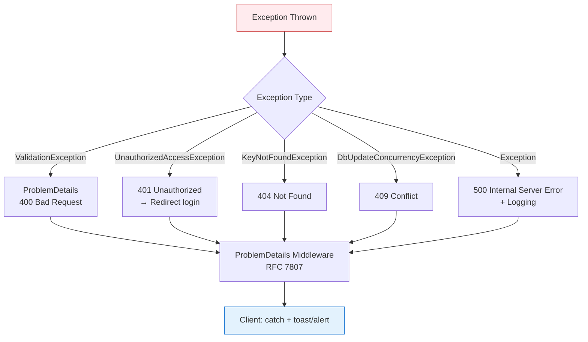

# Client-Server Interaction Flow (Hosted SPA)

> **Tech Stack**: React + TypeScript + Vite (Client) ↔ ASP.NET Core Web API (.NET 10)  
> **Deployment**: Hosted SPA — .NET serves `wwwroot/` (React build) + API controllers

---

## 1. High-Level Request Flow (GET /api/problems)

```mermaid
flowchart TD
    subgraph Client["🌐 Client (Browser)"]
        A[User clicks "Problems"] --> B[React Router navigates to /problems]
        B --> C[useProblems hook fires]
        C --> D[fetch('/api/problems')]
    end

    subgraph Network["📡 Network"]
        D -->|HTTP GET /api/problems| E[.NET Kestrel Server]
    end

    subgraph Server["🖥️ ASP.NET Core API (Port 5001)"]
        E --> F[Static File Middleware\nwwwroot/ → index.html for SPA routes]
        E --> G[Routing Middleware\nMapControllers()]
        G --> H[Controller: ProblemsController]
        H --> I[Action: GetProblems()]
        I --> J[Service: IProblemService.GetAllAsync()]
        J --> K[Repository: IProblemRepository.GetAllAsync()]
        K --> L[(EF Core DbContext\nSQLite / SQL Server)]
        L --> K
        K --> J
        J --> I
        I --> M[JSON Serializer\ncamelCase]
        M --> N[HTTP 200 OK + JSON Body]
    end

    subgraph Response["📥 Client Processing"]
        N --> O[fetch resolves Response]
        O --> P[response.json()]
        P --> Q[TypeScript typed: Problem[]]
        Q --> R[React state update]
        R --> S[Re-render ProblemList component]
    end

    style Client fill:#e3f2fd,stroke:#1976d2
    style Server fill:#f3e5f5,stroke:#7b1fa2
    style Network fill:#fff3e0,stroke:#f57c00
    style Response fill:#e8f5e9,stroke:#388e3c
```

---

## 2. Detailed Middleware Pipeline (ASP.NET Core)

```mermaid
flowchart TD
    Request[Incoming HTTP Request] --> Term[Terminal Middleware?]
    
    Term -->|Yes: Static File| Static[UseStaticFiles\nwwwroot/index.html]
    Term -->|Yes: SPA Fallback| SpaFallback[MapFallbackToFile\nindex.html]
    Term -->|No: API Route| Pipeline[Middleware Pipeline]
    
    Pipeline --> HTTPS[UseHttpsRedirection]
    HTTPS --> Cors[UseCors\n(Dev: permissive)]
    Cors --> Auth[UseAuthentication\nJWT validation]
    Auth --> Authz[UseAuthorization\n[Authorize] policies]
    Authz --> Routing[UseRouting]
    Routing --> Endpoints[UseEndpoints\nMapControllers]
    
    Endpoints --> Controller[ProblemsController]
    
    Controller -->|GET| GetAction[GetProblems]
    Controller -->|POST| PostAction[SubmitSolution]
    Controller -->|GET :id| GetOneAction[GetProblemById]
    
    GetAction --> Service[IProblemService]
    Service --> Repo[IProblemRepository]
    Repo --> Db[EF Core DbContext]
    Db --> SQL[(Database)]
    
    SQL --> Db
    Db --> Repo
    Repo --> Service
    Service --> GetAction
    GetAction --> Result[ActionResult<ProblemDto[]>]
    Result --> Serializer[System.Text.Json\ncamelCase + enums as strings]
    Serializer --> Response[HTTP Response]
    
    Static --> Response
    SpaFallback --> Response
    
    style Request fill:#ffebee,stroke:#c62828
    style Response fill:#e8f5e9,stroke:#388e3c
    style SQL fill:#fce4ec,stroke:#c2185b
```

---

## 3. Hosted SPA — Dual Serving Behavior

```mermaid
flowchart LR
    subgraph Dev["Development (Two Ports)"]
        D1[Vite Dev Server :5173] -->|/api/* proxy| D2[.NET API :5001]
        D1 -->|Hot Module Replacement| D3[Browser]
    end
    
    subgraph Prod["Production (Single Port :8080)"]
        P1[Kestrel :8080] --> P2[Static Files Middleware]
        P2 -->|/api/*| P3[Controllers]
        P2 -->|/* (SPA routes)| P4[index.html\nwwwroot/]
        P4 --> P3
    end
    
    style Dev fill:#e3f2fd,stroke:#1976d2
    style Prod fill:#f3e5f5,stroke:#7b1fa2
```

---

## 4. Type-Safe Contract Flow (OpenAPI → TypeScript)

```mermaid
flowchart TD
    A[Controller + DTOs\nC# Records] -->|Attributes| B[OpenAPI Spec\n/openapi/v1.json]
    B -->|Codegen| C[openapi-typescript\n/ NSwag]
    C --> D[api.ts\nTypeScript Types]
    D --> E[React Hook\nuseProblems()]
    E --> F[fetch + Zod Validation]
    F --> G[Typed Problem[]]
    
    style A fill:#e8f5e9,stroke:#388e3c
    style B fill:#fff3e0,stroke:#f57c00
    style C fill:#f3e5f5,stroke:#7b1fa2
    style D fill:#e3f2fd,stroke:#1976d2
    style G fill:#e8f5e9,stroke:#388e3c
```

---

## 5. Authentication Flow (JWT in HttpOnly Cookie)

```mermaid
sequenceDiagram
    participant Browser
    participant API
    participant DB

    Note over Browser,API: Login Flow
    Browser->>API: POST /api/auth/login {email, password}
    API->>DB: Validate credentials
    DB-->>API: User + roles
    API->>API: Generate JWT (claims: sub, roles, exp)
    API-->>Browser: Set-Cookie: token=jwt; HttpOnly; Secure; SameSite=Strict
    
    Note over Browser,API: Authenticated Request
    Browser->>API: GET /api/problems\nCookie: token=jwt
    API->>API: UseAuthentication → Validate JWT\nUseAuthorization → Check [Authorize]
    API->>DB: Query problems (if authorized)
    DB-->>API: Problem[]
    API-->>Browser: 200 OK + JSON
    
    Note over Browser,API: Logout
    Browser->>API: POST /api/auth/logout
    API-->>Browser: Set-Cookie: token=; Max-Age=0; HttpOnly
```

---

## 6. Error Handling Flow



---

## 7. Key Files Mapping (Where Each Piece Lives)

| Layer | Folder | Key Files |
|-------|--------|-----------|
| **Client UI** | `Client/src/` | `components/ProblemList.tsx`, `hooks/useProblems.ts`, `api/problems.ts` |
| **Client Types** | `Client/src/types/` | `api.ts` (generated from OpenAPI) |
| **Controller** | `Api/Controllers/` | `ProblemsController.cs` |
| **Service** | `Services/` | `ProblemService.cs`, `IProblemService.cs` |
| **Repository** | `Data/Repositories/` | `ProblemRepository.cs`, `IProblemRepository.cs` |
| **Data/ORM** | `Data/` | `AppDbContext.cs`, `Migrations/` |
| **Domain** | `Core/Entities/` | `Problem.cs`, `TestCase.cs`, `Submission.cs`, `User.cs` |
| **DTOs/Contracts** | `Core/Contracts/` | `ProblemDto.cs`, `SubmitRequest.cs` |
| **OpenAPI** | `Api/` | `Program.cs` → `AddOpenApi()` |

---

## 8. Request/Response Example

### GET /api/problems

```http
GET /api/problems HTTP/1.1
Host: localhost:5001
Accept: application/json
Cookie: token=eyJhbGciOiJIUzI1NiIs...
```

```http
HTTP/1.1 200 OK
Content-Type: application/json; charset=utf-8

[
  {
    "id": "3fa85f64-5717-4562-b3fc-2c963f66afa6",
    "title": "Two Sum",
    "difficulty": "Easy",
    "tags": ["array", "hash-table"],
    "acceptanceRate": 0.473,
    "createdAt": "2026-01-15T10:30:00Z"
  },
  {
    "id": "7c9e8d2a-4b1f-4a7c-9e2d-1f3a5b6c7d8e",
    "title": "Median of Two Sorted Arrays",
    "difficulty": "Hard",
    "tags": ["array", "binary-search", "divide-conquer"],
    "acceptanceRate": 0.321,
    "createdAt": "2026-02-20T14:15:00Z"
  }
]
```

---

## Next Steps (Implementation Order)

1. **Domain Entities** → `Core/Entities/*.cs` (Problem, TestCase, Submission, User)
2. **DTOs/Contracts** → `Core/Contracts/*.cs` (ProblemDto, SubmitRequest, etc.)
3. **EF Core Setup** → `Data/AppDbContext.cs`, migrations
4. **Repositories** → `Data/Repositories/*.cs`
5. **Services** → `Services/*.cs`
6. **Controllers** → `Api/Controllers/*.cs`
7. **OpenAPI Config** → `Api/Program.cs` + `appsettings.Development.json`
8. **Client Types** → Run codegen → `Client/src/types/api.ts`
9. **React Hooks/Components** → `Client/src/hooks/`, `Client/src/components/`